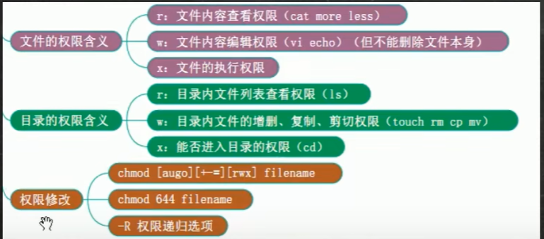

# 考虑因素

- ✔ 注意权限分离，比如：工作中，Linux系统权限和数据库权限不要在同一个部门
- ✔ 权限最小原则(即：在满足使用的情况下最少优先)
- ✔ 减少使用root用户，尽量用普通用户+sudo提权进行日常操作。
- ✔ 重要的系统文件，比如`/etc/passwd`，`/etc/shadow`，`/etc/fstab`，`/etc/sudoers`等，日常建议使用chattr锁定，需要操作时再打开。【演示 比如：锁定 `/etc/passwd` 让任何用户都不能随意useradd，除非解除锁定】
- ✔ 使用SUID, SGID, Sticky 设置特殊权限。
- ✔ 可以利用工具，比如chkrootkit/rootkit hunter 检测rootkit脚本（rootkit是入侵者使用工具，在不察觉的建立了入侵系统途径）【演示使用 `wget ftp://ftp.pangeia.com.br/pub/seg/pac/chkrootkit.tar.gz`】
- ✔ 利用工具Tripwire 检测文件系统完整性

## 案例（1）

1. 创建用户smith，允许任意远程连接

```bash
CREATE USER 'smith'@'%' IDENTIFIED BY 'Abc@123456';
```
2. 只给 smith 【project】这个项目库全部权限，别的库完全不给

```bash
GRANT ALL PRIVILEGES ON `project`.* TO 'smith'@'%';
```
3. 刷新权限生效

```bash
FLUSH PRIVILEGES;
```
4. 回收全部库的权限

```bash
REVOKE ALL PRIVILEGES ON *.* FROM 'smith'@'%';
FLUSH PRIVILEGES;
```

## 案例（2）

1. 只给部分权限（生产环境推荐，最小权限原则）不直接给 ALL，只给业务需要的增删改查：

```bash
GRANT SELECT,INSERT,UPDATE,DELETE ON `project`.* TO 'smith'@'%';
FLUSH PRIVILEGES;
```
2. 验证权限

```bash
SHOW GRANTS FOR 'smith'@'%';
```

## 案例（3）

**tom 用户只能读写 /data/project_tom；smith 用户只能读写 /data/project_smith，互相隔离**

1. 创建系统用户

```bash
useradd tom
passwd tom

useradd smith
passwd smith
```
2. 创建各自项目目录

```bash
mkdir -p /data/project_tom
mkdir -p /data/project_smith
```
3. 修改目录属主

```bash
#把文件判给对应的人
chown -R tom:tom /data/project_tom
chown -R smith:smith /data/project_smith
```
4. 设置目录权限

```bash
#上锁
chmod 700 /data/project_tom
chmod 700 /data/project_smith
```
5. 拓展：各用户共用一个目录

```bash
# 创建一个项目组
groupadd proj_group
# 文件夹归属root，组是proj_group
chown -R root:proj_group /data/project_common
# 组内的人可以读写，外人不行
chmod 770 /data/project_common
# 把tom、smith加到这个组
usermod -aG proj_group tom
usermod -aG proj_group smith
```

##chattr用法 针对/etc/passwd、/etc/shadow、/etc/sudoers、/etc/fstab
>chmod控制用户rwx权限；chattr设置系统级锁
```bash
# 上锁
chattr +i /etc/passwd
# 解锁
chattr -i /etc/passwd
#查看文件有没有被锁
lsattr /etc/passwd
# +a 尽在末尾追加内容 不可以修改不可以删除
chattr +a /var/log/messages
```