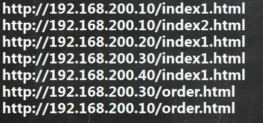

# 分析日志t.log(访问量)，将各个ip地址截取，并统计出现次数,并按从大到小排序

## 分析日志 截取各个ip统计出现次数 倒序



```bash
 cat t.txt | cut -d '/' -f 3 | sort | uniq -c | sort -nr
```

**查看并按照 cut / 划分 查看第三部分 sort排序 uniq -c 去重统计重复行 sort -nr 按照数字倒序**

**注意：cut不可以用空格分隔**

**注意：uniq -c 统计的是相邻的数据 不可以乱序中统计 所以要先sort排序**

## 统计镰刀服务器的各个ip情况 按照连接数倒序

```bash
netstat -an | grep ESTABLIS | awk -F ' ' '{print $5}' | awk -F ':' '{print $1}' | sort | uniq -c | sort -nr
```

**netstat -an | grep ESTABLIS 检查连接状态的网络 awk可以以空格分隔 比较常用 '{print $5}'输出序列为5的内容**

**注意：网络连接本身在动态变化！**
